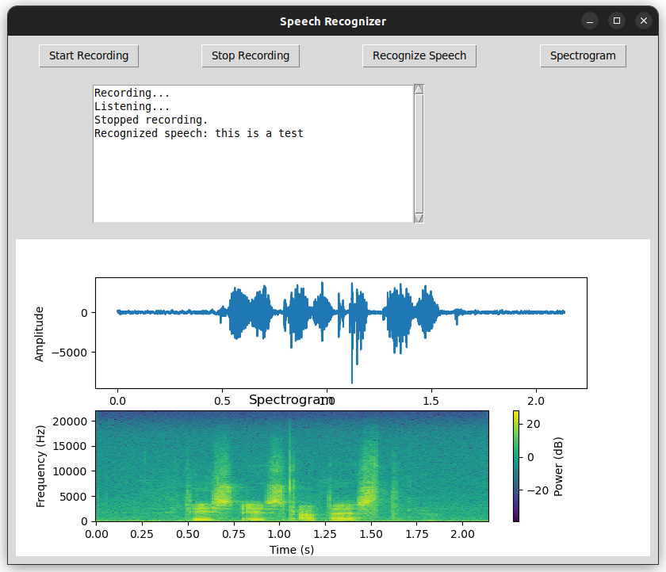

# Python speech recognition application

### Running the application
To run the application, simply run `sr.py`.
`python3 sr.py`

### Using the application
- Record by pressing "Start Recording"
- Stop recording when ready by pressing "Stop Recording"
- Use Google speech recognition on the previous recording by pressing "Recognize speech"
- Press "Spectrogram" to view a spectrogram of the recording

### MIT License
Free to use as you wish.

Written by Miikka Mäki (mimimaki) initially in 26.04.2024, latest modification: tkinter GUI addded in 16.12.2024.